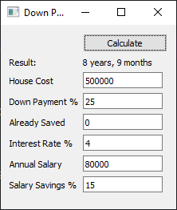

# Down Payment Calculator

*Calculate the length of time required to afford a house down payment.*

## How To Use

There are two ways to use this program: graphically and on the command line.

While in the `source` directory, type the following into your terminal (using `python` if on Windows and `python3` if on GNU/Linux):

    $ python main.py
...will run the graphical version of the program.

    $ python main.py cli
...will run the command line version of the program.

## Program Details

The calculation uses the formula for annual interest compounded monthly, or `P(1 + R / 12)`.

